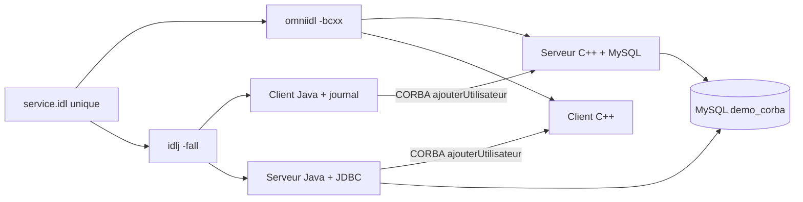

# Rapport complet - Mini-projet CORBA polyglotte

## 1. Objectif du projet

Le projet met en communication des composants Java et C++ avec CORBA. Le service distant permet d'ajouter un utilisateur dans une base MySQL et de retourner un message de confirmation.

Le projet respecte le besoin initial :

- Java client vers serveur C++ ;
- insertion dans MySQL côté serveur ;
- journal d'audit local côté client Java ;
- génération des stubs et skeletons à partir d'un contrat IDL commun.

Une extension a ensuite été ajoutée :

- Java serveur vers client C++ ;
- même méthode distante ;
- même fichier `idl/service.idl` ;
- aucune duplication du contrat CORBA.

## 2. Architecture finale



CORBA sépare le contrat de l'implémentation. Le client et le serveur peuvent donc être écrits dans des langages différents, à condition de générer leurs artefacts à partir du même IDL.

## 3. Arborescence finale

```text
S5_MR_TAHIANA/
├── idl/
│   └── service.idl
├── database/
│   └── init.sql
├── cpp-server/
│   ├── CMakeLists.txt
│   ├── main.cpp              # serveur C++
│   ├── client.cpp            # client C++ ajouté
│   └── build-wsl/            # génération et compilation WSL
├── java-client/
│   ├── pom.xml
│   ├── src/main/java/com/example/
│   │   ├── ClientAudit.java # client Java initial
│   │   └── ServerJava.java   # serveur Java ajouté
│   ├── ServiceModule/        # stubs Java générés par idlj
│   ├── bin/                  # classes compilées
│   └── lib/                  # dépendances Maven, dont MySQL Connector/J
└── rapport-projet-corba.md
```

## 4. Le contrat IDL

### Quoi ?

IDL signifie *Interface Definition Language*. C'est un langage neutre qui décrit les opérations distantes sans imposer C++, Java ou un autre langage.

### Pourquoi ?

Un seul IDL garantit que les deux langages utilisent :

- le même nom de module ;
- le même nom d'interface ;
- les mêmes paramètres ;
- le même type de retour.

Cela évite de maintenir deux contrats différents.

### Comment ?

Fichier [service.idl](idl/service.idl) :

```idl
module ServiceModule {
    interface ServiceUtilisateur {
        string ajouterUtilisateur(in string nom);
    };
};
```

Syntaxe :

- `module ServiceModule` correspond approximativement à un namespace C++ ou un package logique Java ;
- `interface ServiceUtilisateur` décrit l'objet distant ;
- `string` est le type de retour ;
- `in string nom` indique un paramètre envoyé du client vers le serveur ;
- `ajouterUtilisateur` est l'opération invoquée à distance.

## 5. Génération du code CORBA

### C++

Depuis `cpp-server/`, CMake lance automatiquement :

```bash
omniidl -bcxx ../idl/service.idl
```

Cette commande génère notamment :

- `service.hh` : déclarations C++ ;
- `serviceSK.cc` : skeleton et code d'adaptation CORBA.

Le serveur hérite du skeleton :

```cpp
class ServiceUtilisateur_impl
    : public POA_ServiceModule::ServiceUtilisateur {
    // implémentation de ajouterUtilisateur
};
```

Le client utilise le proxy généré :

```cpp
ServiceModule::ServiceUtilisateur_var service =
    ServiceModule::ServiceUtilisateur::_narrow(object);
```

### Java

Avec le JDK 8 installé dans WSL :

```bash
cd java-client
/usr/lib/jvm/java-8-openjdk-amd64/bin/idlj -fall ../idl/service.idl
```

Les classes générées incluent :

- `ServiceUtilisateur.java` ;
- `ServiceUtilisateurHelper.java` ;
- `ServiceUtilisateurPOA.java` ;
- `_ServiceUtilisateurStub.java`.

Le serveur Java hérite de `ServiceUtilisateurPOA`, tandis que le client utilise `ServiceUtilisateurHelper.narrow(...)`.

## 6. Base de données

Fichier [init.sql](database/init.sql) :

```sql
CREATE DATABASE IF NOT EXISTS demo_corba;
USE demo_corba;

CREATE TABLE IF NOT EXISTS utilisateurs (
    id INT AUTO_INCREMENT PRIMARY KEY,
    nom VARCHAR(100) NOT NULL,
    date_creation TIMESTAMP DEFAULT CURRENT_TIMESTAMP
);
```

### Rôle des éléments SQL

- `CREATE DATABASE IF NOT EXISTS` rend l'initialisation répétable ;
- `AUTO_INCREMENT` crée un identifiant unique ;
- `nom` contient le nom de l'utilisateur ;
- `date_creation` est rempli automatiquement par MySQL.

Commande utilisée dans WSL :

```bash
mysql -u root -ppassword demo_corba < database/init.sql
```

## 7. Serveur C++

Fichier [main.cpp](cpp-server/main.cpp).

### Fonctionnement

1. Initialisation de l'ORB :

```cpp
CORBA::ORB_var orb = CORBA::ORB_init(argc, argv);
```

2. Récupération du POA :

```cpp
CORBA::Object_var obj =
    orb->resolve_initial_references("RootPOA");
PortableServer::POA_var poa = PortableServer::POA::_narrow(obj);
poa->the_POAManager()->activate();
```

3. Création du servant et conversion en référence distante :

```cpp
ServiceUtilisateur_impl* myobj = new ServiceUtilisateur_impl();
ServiceModule::ServiceUtilisateur_var myobj_ref = myobj->_this();
```

4. Export de la référence dans `ref.ior` :

```cpp
CORBA::String_var ior = orb->object_to_string(myobj_ref);
FILE* file = fopen("ref.ior", "w");
fprintf(file, "%s", static_cast<char*>(ior));
fclose(file);
```

5. Attente des appels clients :

```cpp
orb->run();
```

### Traitement MySQL

La méthode distante reçoit le nom, ouvre une connexion MySQL, effectue l'insertion et récupère l'identifiant généré :

```cpp
std::string query =
    "INSERT INTO utilisateurs (nom) VALUES ('"
    + std::string(nom) + "');";
mysql_query(conn, query.c_str());
my_ulonglong id_genere = mysql_insert_id(conn);
```

La réponse retournée est construite avec `CORBA::string_dup` :

```cpp
return CORBA::string_dup(reponse.c_str());
```

## 8. Client Java initial et journal d'audit

Fichier [ClientAudit.java](java-client/src/main/java/com/example/ClientAudit.java).

Le client :

1. initialise l'ORB Java ;
2. lit `../cpp-server/ref.ior` ;
3. convertit l'IOR en objet CORBA ;
4. demande un nom ;
5. appelle `ajouterUtilisateur` ;
6. écrit la réponse dans `journal_audit.txt`.

Extrait de l'appel distant :

```java
Object objRef = orb.string_to_object(ior);
ServiceUtilisateur service =
    ServiceUtilisateurHelper.narrow(objRef);
String resultat = service.ajouterUtilisateur(nomInput);
```

Extrait de l'audit :

```java
try (FileWriter fw = new FileWriter(JOURNAL_FILE, true);
     PrintWriter pw = new PrintWriter(fw)) {
    pw.println("[" + LocalDateTime.now()
        + "] AUDIT_LOG: " + message);
}
```

Résultat validé :

```text
[2026-09-23T22:46:01.068] AUDIT_LOG: Succès : Utilisateur 'Alice' créé avec l'ID #1
```

## 9. Compilation C++ avec WSL

Les outils utilisés sont ceux d'Ubuntu WSL : GCC, CMake, omniORB et MySQL Connector/C.

```bash
cd /mnt/c/Users/Misai/Desktop/S5_MR_TAHIANA/cpp-server
cmake -S . -B build-wsl
cmake --build build-wsl --parallel 2
```

Fichier [CMakeLists.txt](cpp-server/CMakeLists.txt) :

```cmake
add_executable(server main.cpp serviceSK.cc)
add_executable(client client.cpp serviceSK.cc)
target_link_libraries(server omniORB4 omnithread ${MYSQL_LIBRARY})
target_link_libraries(client omniORB4 omnithread)
```

Les deux exécutables compilés sont :

```text
cpp-server/build-wsl/server
cpp-server/build-wsl/client
```

## 10. Extension inverse : serveur Java et client C++

### Serveur Java

Fichier [ServerJava.java](java-client/src/main/java/com/example/ServerJava.java).

Le servant Java hérite du skeleton généré :

```java
private static class ServiceUtilisateurImpl
        extends ServiceUtilisateurPOA {
    @Override
    public String ajouterUtilisateur(String nom) {
        // insertion JDBC et retour du message
    }
}
```

L'insertion Java utilise une requête préparée :

```java
String sql = "INSERT INTO utilisateurs (nom) VALUES (?)";
PreparedStatement statement =
    connection.prepareStatement(sql, new String[]{"id"});
statement.setString(1, nom);
statement.executeUpdate();
```

Le serveur Java exporte son IOR dans :

```text
java-client/ref-java.ior
```

### Client C++

Fichier [client.cpp](cpp-server/client.cpp).

Le client lit l'IOR Java :

```cpp
std::ifstream ior_file("../java-client/ref-java.ior");
std::getline(ior_file, ior);
```

Il obtient ensuite la référence distante et appelle exactement la même opération :

```cpp
ServiceModule::ServiceUtilisateur_var service =
    ServiceModule::ServiceUtilisateur::_narrow(object);
CORBA::String_var resultat = service->ajouterUtilisateur(nom);
```

La cible C++ accepte le nom en argument :

```bash
./build-wsl/client Bob
```

## 11. Compilation Java

Les stubs sont générés avec Java 8 :

```bash
cd java-client
/usr/lib/jvm/java-8-openjdk-amd64/bin/idlj -fall ../idl/service.idl
```

Compilation manuelle :

```bash
mkdir -p bin
/usr/lib/jvm/java-8-openjdk-amd64/bin/javac \
  -source 8 -target 8 -d bin \
  src/main/java/com/example/ClientAudit.java \
  src/main/java/com/example/ServerJava.java \
  ServiceModule/*.java
```

Dépendances Java :

```bash
mvn -q dependency:copy-dependencies -DoutputDirectory=lib
```

Le POM [pom.xml](java-client/pom.xml) fournit MySQL Connector/J :

```xml
<dependency>
    <groupId>com.mysql</groupId>
    <artifactId>mysql-connector-j</artifactId>
    <version>8.4.0</version>
</dependency>
```

## 12. Procédure complète de test

Toutes les commandes suivantes sont à exécuter dans Ubuntu WSL, depuis la racine du projet :

```bash
cd /mnt/c/Users/Misai/Desktop/S5_MR_TAHIANA
```

### Étape 1 - Vérifier les outils

```bash
java -version
/usr/lib/jvm/java-8-openjdk-amd64/bin/java -version
g++ --version
cmake --version
omniidl -V
mysql --version
mvn -version
```

Le JDK 8 est utilisé pour `idlj`, car les JDK récents ne fournissent plus ce compilateur CORBA.

### Étape 2 - Initialiser et vérifier MySQL

```bash
mysql -u root -ppassword demo_corba < database/init.sql
mysql -u root -ppassword -e "SHOW DATABASES LIKE 'demo_corba';"
mysql -u root -ppassword -e "DESCRIBE demo_corba.utilisateurs;"
```

Résultat attendu : la base `demo_corba` et la table `utilisateurs` existent.

### Étape 3 - Générer les stubs Java

```bash
cd java-client
rm -rf ServiceModule bin lib
/usr/lib/jvm/java-8-openjdk-amd64/bin/idlj -fall ../idl/service.idl
find ServiceModule -maxdepth 1 -type f -print
```

Les fichiers `ServiceUtilisateurPOA.java`, `ServiceUtilisateurHelper.java` et `_ServiceUtilisateurStub.java` doivent apparaître.

### Étape 4 - Compiler Java et récupérer JDBC

```bash
mkdir -p bin
/usr/lib/jvm/java-8-openjdk-amd64/bin/javac \
    -source 8 -target 8 -d bin \
    src/main/java/com/example/ClientAudit.java \
    src/main/java/com/example/ServerJava.java \
    ServiceModule/*.java

mvn -q dependency:copy-dependencies -DoutputDirectory=lib
```

Contrôle :

```bash
test -f bin/com/example/ClientAudit.class
test -f bin/com/example/ServerJava.class
test -n "$(find lib -name 'mysql-connector-j-*.jar' -print -quit)"
echo "Compilation Java et JDBC OK"
```

### Étape 5 - Compiler C++

```bash
cd ../cpp-server
cmake -S . -B build-wsl
cmake --build build-wsl --parallel 2
test -x build-wsl/server
test -x build-wsl/client
echo "Compilation C++ OK"
```

Le build doit produire les deux exécutables : `build-wsl/server` et `build-wsl/client`.

### Étape 6 - Tester Java client vers C++ serveur

Ouvrir un premier terminal WSL :

```bash
cd /mnt/c/Users/Misai/Desktop/S5_MR_TAHIANA/cpp-server
rm -f ref.ior
./build-wsl/server
```

Le serveur doit afficher :

```text
[Serveur C++] En attente des requêtes clients (IOR sauvegardé dans ref.ior)...
```

Dans un second terminal WSL, vérifier l'IOR puis lancer le client :

```bash
cd /mnt/c/Users/Misai/Desktop/S5_MR_TAHIANA
test -s cpp-server/ref.ior && echo "ref.ior OK"
cd java-client
rm -f journal_audit.txt
echo Alice | /usr/lib/jvm/java-8-openjdk-amd64/bin/java \
    -cp "bin:lib/*" com.example.ClientAudit
```

Résultats attendus :

```text
[Serveur C++] Requête reçue pour l'utilisateur : Alice
[Serveur C++] Succès : Utilisateur 'Alice' créé avec l'ID #1
[Client Java] Événement consigné dans 'journal_audit.txt'.
```

Vérifier l'audit :

```bash
test -s journal_audit.txt
grep "Alice" journal_audit.txt
```

Vérifier MySQL :

```bash
mysql -u root -ppassword -e \
    "SELECT id, nom, date_creation FROM demo_corba.utilisateurs WHERE nom='Alice';"
```

### Étape 7 - Tester C++ client vers Java serveur

Arrêter le serveur C++ avec `Ctrl+C`, puis ouvrir un premier terminal WSL :

```bash
cd /mnt/c/Users/Misai/Desktop/S5_MR_TAHIANA/java-client
rm -f ref-java.ior
/usr/lib/jvm/java-8-openjdk-amd64/bin/java \
    -cp "bin:lib/*" com.example.ServerJava
```

Le serveur doit afficher :

```text
[Serveur Java] En attente des requêtes (IOR sauvegardé dans ref-java.ior)...
```

Dans un second terminal WSL :

```bash
cd /mnt/c/Users/Misai/Desktop/S5_MR_TAHIANA
test -s java-client/ref-java.ior && echo "ref-java.ior OK"
cd cpp-server
./build-wsl/client Bob
```

Résultats attendus :

```text
[Serveur Java] Requête reçue pour l'utilisateur : Bob
[Serveur Java] Succès : Utilisateur 'Bob' créé avec l'ID #2
[Client C++] Réponse reçue : Succès : Utilisateur 'Bob' créé avec l'ID #2
```

Vérifier MySQL :

```bash
mysql -u root -ppassword -e \
    "SELECT id, nom, date_creation FROM demo_corba.utilisateurs ORDER BY id DESC LIMIT 2;"
```

La sortie doit contenir `Alice` et `Bob`. Le serveur Java peut ensuite être arrêté avec `Ctrl+C`.

### Étape 8 - Critères de réussite

Le projet est validé si :

1. `service.idl` est le seul contrat utilisé ;
2. les stubs Java et C++ sont générés sans erreur bloquante ;
3. `server` et `client` C++ sont compilés ;
4. `ref.ior` et `ref-java.ior` sont créés ;
5. Java client → C++ serveur insère Alice ;
6. `journal_audit.txt` contient la réponse CORBA pour Alice ;
7. C++ client → Java serveur insère Bob ;
8. les deux lignes sont visibles dans MySQL.

## 13. Validations réalisées

| Validation | Résultat |
|---|---|
| Présence du contrat IDL unique | Réussie |
| Génération C++ par `omniidl` | Réussie |
| Génération Java par `idlj` Java 8 | Réussie |
| Compilation serveur C++ | Réussie |
| Compilation client C++ | Réussie |
| Compilation client Java | Réussie |
| Compilation serveur Java | Réussie |
| Initialisation de `demo_corba` | Réussie |
| Génération de `ref.ior` | Réussie |
| Génération de `ref-java.ior` | Réussie |
| Appel Java vers C++ avec Alice | Réussi |
| Insertion Alice en base | Réussie, ID #1 |
| Écriture de `journal_audit.txt` | Réussie |
| Appel C++ vers Java avec Bob | Réussi |
| Insertion Bob en base | Réussie, ID #2 |

Vérification MySQL réalisée :

```text
2  Bob
1  Alice
```

## 14. Problèmes rencontrés et corrections

### Outils Windows contre outils WSL

Les premières commandes lancées depuis PowerShell ne trouvaient pas GCC, omniidl, MySQL ou Maven. Les outils étaient installés dans Ubuntu WSL. Les compilations finales ont donc été exécutées sous WSL avec des chemins `/mnt/c/...`.

### Inclusion incorrecte du fichier généré C++

Le serveur incluait directement `serviceSK.cc`. Cela provoquait une compilation incorrecte puisque CMake compilait déjà ce fichier. L'inclusion a été remplacée par :

```cpp
#include "service.hh"
```

### Chemin des headers générés

CMake génère `service.hh` dans le dossier de build. Le dossier `${CMAKE_CURRENT_BINARY_DIR}` a donc été ajouté aux includes.

### Namespace CORBA

La référence `_var` appartient à `ServiceModule`, et non à `POA_ServiceModule` :

```cpp
ServiceModule::ServiceUtilisateur_var myobj_ref = myobj->_this();
```

### Authentification MySQL

Ubuntu utilisait initialement `auth_socket`. Après modification de l'utilisateur MySQL, le serveur C++ et le serveur Java peuvent se connecter avec `root/password`.

## 15. Limites et améliorations possibles

Le projet est fonctionnel pour une démonstration CORBA, mais certains éléments doivent être renforcés pour la production :

1. Les identifiants MySQL sont actuellement écrits en dur dans les sources. Ils devraient être lus depuis des variables d'environnement ou un fichier de configuration protégé.
2. L'insertion SQL du serveur C++ concatène actuellement le nom dans la requête. Elle devrait utiliser une API MySQL de requête préparée, comme le serveur Java.
3. Le client C++ inverse n'écrit pas de journal d'audit local. Le besoin initial concernait spécifiquement `ClientAudit.java`.
4. Le service CORBA renvoie un texte d'erreur au lieu de déclarer une exception IDL dédiée.
5. Le serveur Java et le serveur C++ utilisent des fichiers IOR différents pour pouvoir fonctionner séparément : `ref.ior` et `ref-java.ior`.
6. Les stubs Java Java 8 affichent un avertissement lié à une API interne CORBA (`IORCheckImpl`). La compilation reste réussie.
7. Pour un usage réel, il faudrait ajouter des tests automatisés, une validation de longueur du nom et une gestion centralisée des connexions MySQL.

## 16. Conclusion

Le mini-projet demandé est réalisé et étendu. Le contrat `service.idl` reste unique et permet les deux combinaisons suivantes :

```text
Client Java  -> Serveur C++ -> MySQL
Client C++   -> Serveur Java -> MySQL
```

Les deux chemins ont été compilés, démarrés et testés avec des insertions réelles dans MySQL. Le premier chemin a également validé la journalisation locale dans `journal_audit.txt`.
